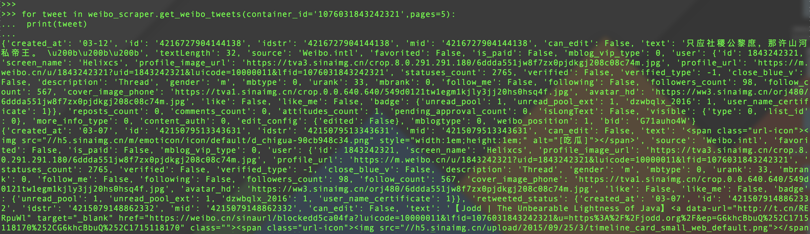

# Weibo Scraper

Simple weibo tweet scraper . Crawl weibo tweets by containedId without authorization.
There are many limitations in official API .
In general , we can inspect mobile site which has it's own API by Chrome.

----
# Installation

```shell
$ pip install weibo-scraper

```

Only Python 3.6+ is supported

----
# Usage

```python
from weibo_scraper import get_weibo_tweets

for tweet in get_weibo_tweets(container_id='1076031843242321',pages=5):
    print(tweet)
```



P.S. Very Thanks For [Twitter-Scraper](https://github.com/kennethreitz/twitter-scraper)

---
# LICENSE

MIT
